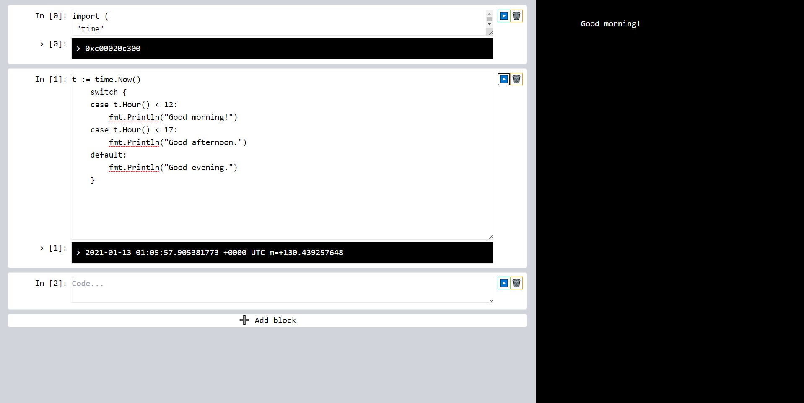

# GoBook
This project is a PoC
Don't take it seriously

The main point of this project is the use of the library [GoLive](https://github.com/brendonmatos/golive)

**Maybe this project go some step to make something more usable (feel free to contribute)**

## Installation
`go get -v github.com/brendonmatos/gobook` 

## Demo
